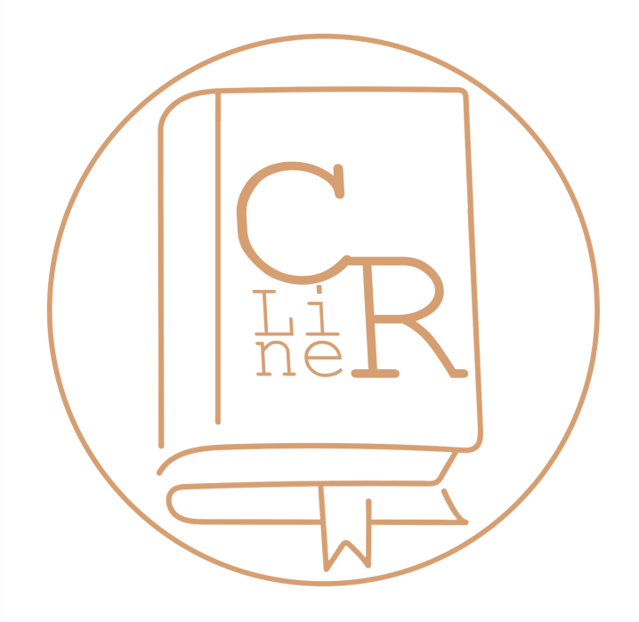
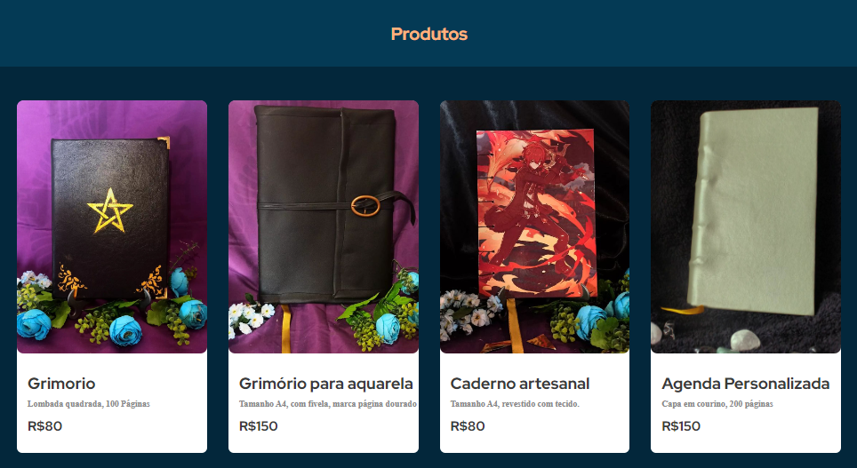
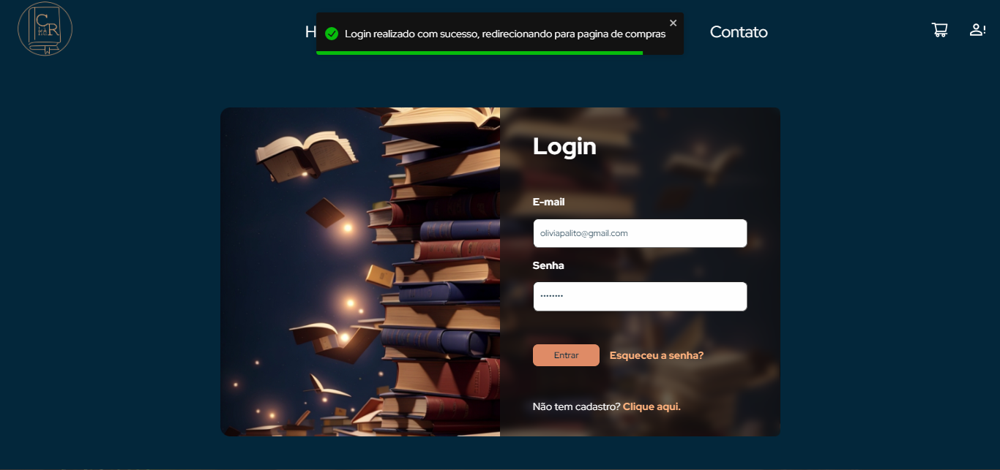
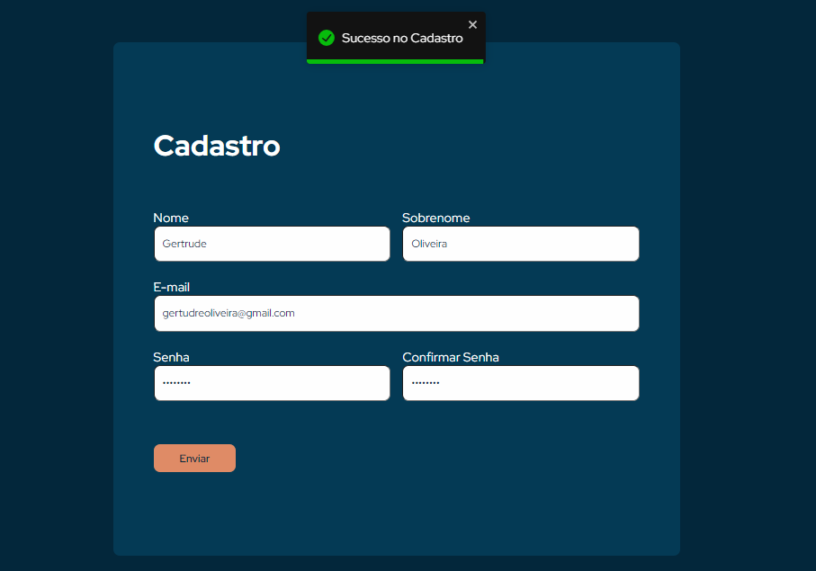
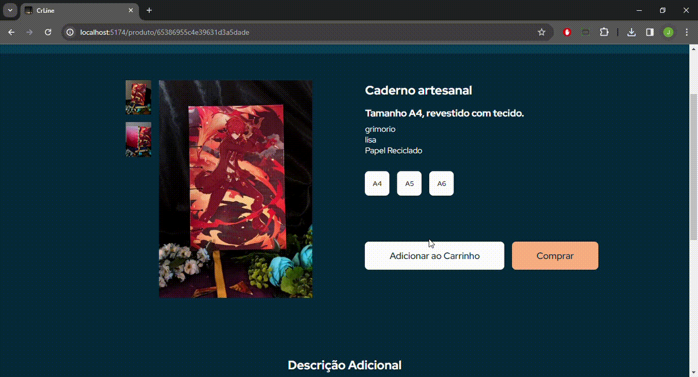

# <a href="#"></a> CRLine - Cadernos Artesanais Personalizados 

**Contexto:** _Desenvolver o front-end de um e-commerce consumindo a API construida no módulo passado_

<div  align="center">
    
    
    
    
    
</div>

## 📚 Sobre a CRLine

 A loja CRLine é um pequeno comércio de cadernos artesanais, com produtos feitos sob encomenda e alguns a pronta entrega.
 Surgiu de um hobby de Charlie Pencal, onde começou a receber pedidos de amigos e depois foi se expandindo naturalmente.


 Veja aqui os slides da apresentação: [Clique Aqui](https://www.canva.com/design/DAFySfwwnwk/wbxOmr2etEB__1Blr-b8kQ/view)
## 🚀 Resultados


### Shop

Essa página apresentas os produtos cadastrados em cards, tendo foto, nome, detalhes e preço de cada item. Em caso de demora da resposta da Api com esses dados, uma mensagem de "carregando produtos" é mostrada para o usuário.

<div align="center">
  
</div>

### Produto

Assim que o cliente escolhe e clica num caderno da página Shop, é encaminhado via parametros o id do produto para que a página Produto apresente mais informações do item escolhido, como mais fotos e especificações.

Única página onde se adiciona itens no carrinho de compra, sendo um botão para só adicionar ao carrinho e continuar na página do Produto, e outro botão para já ir direto para o Carrinho onde se finaliza a compra.

<div align="center">
  
</div>

<small>Feature a serem adicionadas futuramente:

-   Essa seria a página onde o cliente poderia personalizar o produto, escolhendo capa, tamanho da folha, tipo de costura, etc.
-   Apresentar as fotos do produto em slide e responsivo conforme escolhas específicas, como estampa da capa.
    </small>

### Login

Para realizar compra ou ver seus pedidos, o cliente deve logar antes com o e-mail e senha, caso ocorra algum erro de digitação ou até mesmo senha, os inputs irão apresentar uma mensagem de erro. Caso o dados de login estiverem corretos e cadastrados na API, irá aparecer uma mensagem de sucesso e haverá um redirecionamento para a pagina Shop.

<div align="center">
  
</div>

### Cadastro

A partir de um link da página de Login, o cliente pode se cadastrar caso não tenha conta no site ainda. Seguindo as descrições, os campos vão sendo preenchidos e retornando mensagens conforme os requisitos. Assim que cadastrado, há um redirecionamento para a página de Login.

<div align="center">
  
</div>

### Carrinho

Essa página só pode ser acessada se o cliente estiver logado, pois é onde a compra vai ser finalizada. Os itens são apresentados em lista, ou se o carrinho estiver vazio é mostrado a mensagem "Carrinho de compras vazio". Os itens também podem ser excluídos no botão da "lixeira", e para finalizar a compra tem o botão em destaque na lateral, logo abaixo do preço total do pedido.

<div align="center">
  
</div>

### Perfil do Cliente

No Perfil, o cliente consegue vizualizar, editar e excluir seus dados, sendo utilizado modal tanto para coletar essas alterações, como também para confirmar a escolha permanente de excluir a conta. Nessa página também se tem o acesso dos pedidos feito pelo cliente.

<div align="center">
  
</div>

## 🛠️ Como instalar e rodar o App

Tenha o Node.js instalado, caso ainda não tenha, faça o download no link abaixo:

- [Download Node.js](https://nodejs.org/)

Clone o repositório no terminal com o seguinte comando:

```
git clone https://github.com/Charlie-Pencal/CRLinePage.git
```

Entre na pasta onde estão os aquivos:

```
cd CRLinePage
```
Instale os pacotes necessários para a ferramenta funcionar:
```
npm install
```
Rode o App:
```
npm run start
```
Acesse a aplicação no navegador com o seguinte link:
```
http://localhost:5173/
```

- Ps.: Para encerrar a aplicação digite CTRL + C no terminal

## 📄 Referências / Inspirações

[Adobe Color - Análise de Contraste](https://color.adobe.com/pt/create/color-contrast-analyzer)

[Figma - Design do projeto](https://www.figma.com/file/LNdemYDSj2LL5dC26DaQ6Y/CRLine-Page?node-id=0%3A1&mode=dev)

[Vite - Documentação](https://vitejs.dev/guide/)

[Styled Components - Documentação](https://styled-components.com/docs/basics#installation)

[Axios - Documentação](https://www.npmjs.com/package/axios)